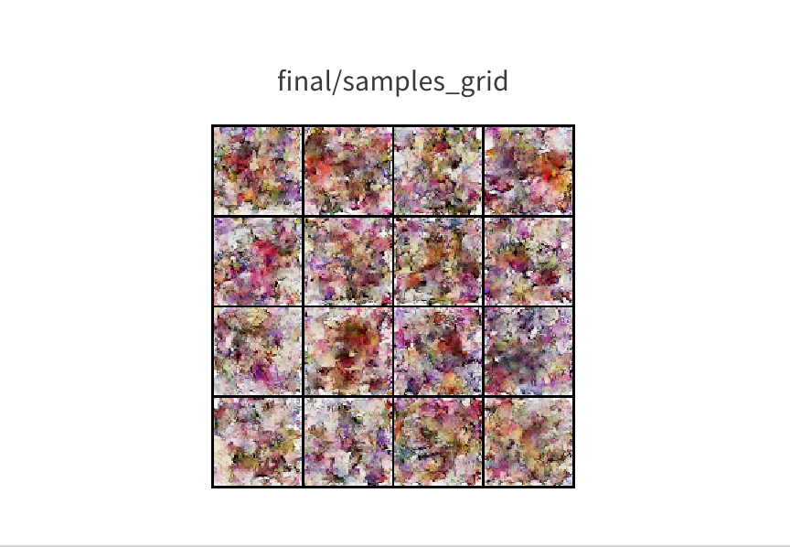
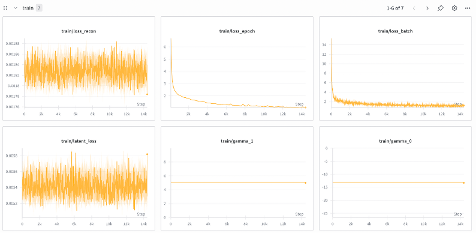
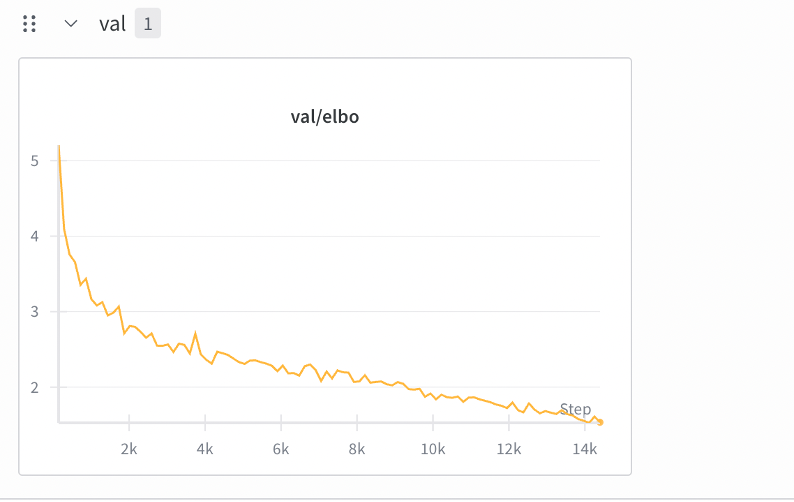
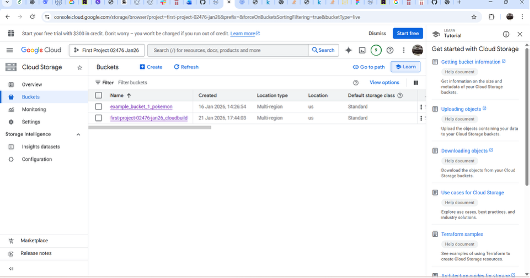
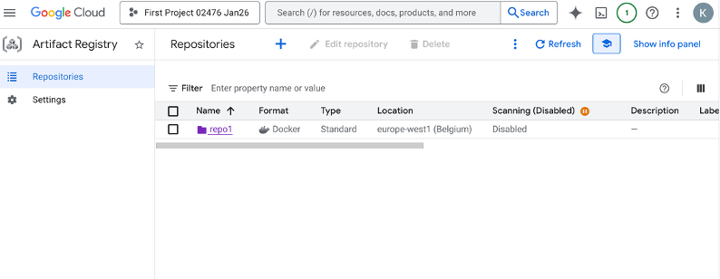
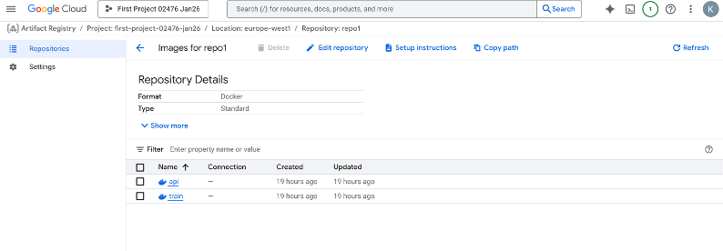
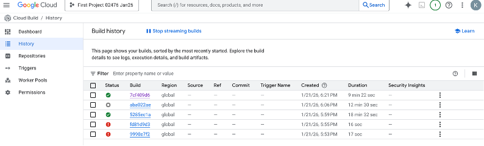
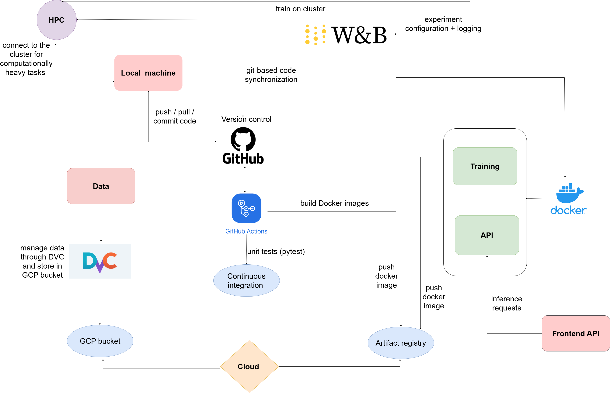

# Exam template for 02476 Machine Learning Operations

This is the report template for the exam. Please only remove the text formatted as with three dashes in front and behind
like:

```--- question 1 fill here ---```

Where you instead should add your answers. Any other changes may have unwanted consequences when your report is
auto-generated at the end of the course. For questions where you are asked to include images, start by adding the image
to the `figures` subfolder (please only use `.png`, `.jpg` or `.jpeg`) and then add the following code in your answer:

``

In addition to this markdown file, we also provide the `report.py` script that provides two utility functions:

Running:

```bash
python report.py html
```

Will generate a `.html` page of your report. After the deadline for answering this template, we will auto-scrape
everything in this `reports` folder and then use this utility to generate a `.html` page that will be your serve
as your final hand-in.

Running

```bash
python report.py check
```

Will check your answers in this template against the constraints listed for each question e.g. is your answer too
short, too long, or have you included an image when asked. For both functions to work you mustn't rename anything.
The script has two dependencies that can be installed with

```bash
pip install typer markdown
```

or

```bash
uv add typer markdown
```

## Overall project checklist

The checklist is *exhaustive* which means that it includes everything that you could do on the project included in the
curriculum in this course. Therefore, we do not expect at all that you have checked all boxes at the end of the project.
The parenthesis at the end indicates what module the bullet point is related to. Please be honest in your answers, we
will check the repositories and the code to verify your answers.

### Week 1

* [X] Create a git repository (M5)
* [X] Make sure that all team members have write access to the GitHub repository (M5)
* [X] Create a dedicated environment for you project to keep track of your packages (M2)
* [X] Create the initial file structure using cookiecutter with an appropriate template (M6)
* [X] Fill out the `data.py` file such that it downloads whatever data you need and preprocesses it (if necessary) (M6)
* [X] Add a model to `model.py` and a training procedure to `train.py` and get that running (M6)
* [X] Remember to either fill out the `requirements.txt`/`requirements_dev.txt` files or keeping your
    `pyproject.toml`/`uv.lock` up-to-date with whatever dependencies that you are using (M2+M6)
* [X] Remember to comply with good coding practices (`pep8`) while doing the project (M7)
* [X] Do a bit of code typing and remember to document essential parts of your code (M7)
* [X] Setup version control for your data or part of your data (M8)
* [X] Add command line interfaces and project commands to your code where it makes sense (M9)
* [X] Construct one or multiple docker files for your code (M10)
* [X] Build the docker files locally and make sure they work as intended (M10)
* [X] Write one or multiple configurations files for your experiments (M11)
* [X] Used Hydra to load the configurations and manage your hyperparameters (M11)
* [X] Use profiling to optimize your code (M12)
* [X] Use logging to log important events in your code (M14)
* [X] Use Weights & Biases to log training progress and other important metrics/artifacts in your code (M14)
* [X] Consider running a hyperparameter optimization sweep (M14)
* [ ] Use PyTorch-lightning (if applicable) to reduce the amount of boilerplate in your code (M15)

### Week 2

* [X] Write unit tests related to the data part of your code (M16)
* [X] Write unit tests related to model construction and or model training (M16)
* [X] Calculate the code coverage (M16)
* [X] Get some continuous integration running on the GitHub repository (M17)
* [X] Add caching and multi-os/python/pytorch testing to your continuous integration (M17)
* [ ] Add a linting step to your continuous integration (M17)
* [ ] Add pre-commit hooks to your version control setup (M18)
* [ ] Add a continues workflow that triggers when data changes (M19)
* [ ] Add a continues workflow that triggers when changes to the model registry is made (M19)
* [X] Create a data storage in GCP Bucket for your data and link this with your data version control setup (M21)
* [X] Create a trigger workflow for automatically building your docker images (M21)
* [ ] Get your model training in GCP using either the Engine or Vertex AI (M21)
* [X] Create a FastAPI application that can do inference using your model (M22)
* [ ] Deploy your model in GCP using either Functions or Run as the backend (M23)
* [X] Write API tests for your application and setup continues integration for these (M24)
* [X] Load test your application (M24)
* [ ] Create a more specialized ML-deployment API using either ONNX or BentoML, or both (M25)
* [X] Create a frontend for your API (M26)

### Week 3

* [X] Check how robust your model is towards data drifting (M27)
* [ ] Setup collection of input-output data from your deployed application (M27)
* [ ] Deploy to the cloud a drift detection API (M27)
* [X] Instrument your API with a couple of system metrics (M28)
* [ ] Setup cloud monitoring of your instrumented application (M28)
* [X] Create one or more alert systems in GCP to alert you if your app is not behaving correctly (M28)
* [ ] If applicable, optimize the performance of your data loading using distributed data loading (M29)
* [ ] If applicable, optimize the performance of your training pipeline by using distributed training (M30)
* [X] Play around with quantization, compilation and pruning for you trained models to increase inference speed (M31)

### Extra

* [ ] Write some documentation for your application (M32)
* [ ] Publish the documentation to GitHub Pages (M32)
* [X] Revisit your initial project description. Did the project turn out as you wanted?
* [ ] Create an architectural diagram over your MLOps pipeline
* [X] Make sure all group members have an understanding about all parts of the project
* [X] Uploaded all your code to GitHub

## Group information

### Question 1
> **Enter the group number you signed up on <learn.inside.dtu.dk>**
>
> Answer:

Group 23

### Question 2
> **Enter the study number for each member in the group**
>
>
> Answer:

s250199, s240051, s225102, s215114, s257197

### Question 3
> **Did you end up using any open-source frameworks/packages not covered in the course during your project? If so**
> **which did you use and how did they help you complete the project?**
>
>
> Answer:

During our project we used the third-party framework EMA-Pytorch.  EMA-Pytorch (Exponential Moving Average) is a very common method used in generative models, like the Variational Diffusion Models (VDM) in our case, which is used to ensure weight stability during the training process. EMA works as follows: it creates a copy of the model’s weights without using the latest weights from the last training step, but by maintaining a running average that pays more attention to the most recent steps. This process helped improve the quality of our generated images.

## Coding environment

> In the following section we are interested in learning more about you local development environment. This includes
> how you managed dependencies, the structure of your code and how you managed code quality.

### Question 4

> **Explain how you managed dependencies in your project? Explain the process a new team member would have to go**
> **through to get an exact copy of your environment.**
>
>
> Answer:

We managed our dependencies by using a designated requirements.txt file with all the related installations that are required to run our project. Packages were installed using pip install <package-name> and once verified, we used pip freeze > requirements.txt. Also, we use dependencies in files such as pyproject.toml,  and uv.lock. We also implemented Dockerfiles for the training and API components. These images encapsulate runtime dependencies, making it easier to reproduce and install all required dependencies by just building and running the image. The steps for someone to go through an exact copy are to clone the repository and run the following command: $ pip install -r requirements.txt. Alternatively, they may build and run the Docker images as documented in the project’s README. This approach provided reproducibility on both local machines and the HPC environment we used during the course. 

### Question 5

> **We expect that you initialized your project using the cookiecutter template. Explain the overall structure of your**
> **code. What did you fill out? Did you deviate from the template in some way?**
>
>
> Answer:

Our group initialized the project using the Cookiecutter structure. We began by setting up the src directory, where we implemented model.py, data.py, and train.py within the vdm_pokemon subfolder. In the same directory, we also added an api.py file, which initializes a FastAPI server and visualizes the model’s outputs—specifically, images generated by the variational diffusion model (VDM) during training. 

In addition to the original project structure, we implemented a unet.py file, as variational diffusion models require a U-Net architecture. We also made extensive use of the tests directory, which contains both the default tests and additional tests designed to detect data drift in the model. 

Other directories, such as docs and reports, were not used, as the project was brief and no additional documentation was produced by the authors. 

### Question 6

> **Did you implement any rules for code quality and format? What about typing and documentation? Additionally,**
> **explain with your own words why these concepts matters in larger projects.**
>
>
> Answer:

In our pyproject.toml file we have included ruff to ensure a 120-character line limit and pep8 standards, and used it to check our code locally. We did not use typing, and our documentation was rather limited. However, we still included docstrings and comments to explain how functions work and highlight important information in some parts of our code.   

Applying these concepts  in larger projects matters because it makes collaboration, a challenging aspect of large-scale projects, easier. More specifically, documentation gives information and details about how the processes work. The most important feature of typing is that it finds bugs that although they are not obvious from the start, may crash the code at a later point. Implementing rules for code quality and format helps keep the code structure consistent, thus making the code readable but also understood by the developers. 

## Version control

> In the following section we are interested in how version control was used in your project during development to
> corporate and increase the quality of your code.

### Question 7

> **How many tests did you implement and what are they testing in your code?**
>
>
> Answer:

In total we implemented 14 tests, where 11 are unit tests for the VDM diffusion model and the U-Net, checking schedule endpoints, diffusion sampling math, log probability shapes, numerical stability and output shapes. Two were integration tests using the FastAPI TestClient and the httppx, that validate the health endpoint and that the generate endpoint returns a PNG image. The test for the data was a placeholder while the cloud dataset was available. We also added a Locust load test script for performance runs. The api tests verify the FastAPI service responds correctly as the root endpoint returns the expected health message, and the generate endpoint returns a 64×64 PNG image. 

### Question 8

> **What is the total code coverage (in percentage) of your code? If your code had a code coverage of 100% (or close**
> **to), would you still trust it to be error free? Explain you reasoning.**
>
>
> Answer:

The total coverage reported is 95%. By module, we report a coverage of 88% for api.py, 96% coverage for mode.py and 100% coverage for unet.py. If we were to reach 100%, we would not trust that the system would run seamlessly. Full coverage can be reached in multiple ways by just going, it just shows that lines were executed during tests, not that the behavior is correct or that the assertions are meaningful. It also does not guarantee that we tested important cases, error handlings or performance under certain unknown scenarios. For machine learning applications, errors appear when different inputs are used or in different hardware. Nevertheless, high coverage is still useful because it reduces the chance of completely unchecked paths, inputs or assertions. We strive to test the behaviors we know the model should have. 

### Question 9

> **Did you workflow include using branches and pull requests? If yes, explain how. If not, explain how branches and**
> **pull request can help improve version control.**
>
>
> Answer:

Our workflow included very limited use of branches and pull requests. For most of the project, we worked directly on the main branch and only created a single additional branch when merging larger changes. This approach was effective because the project used a Cookiecutter template, and responsibilities were clearly divided by folders. For example, one team member worked on the VDM model in the src folder, while another focused on the tests folder. By assigning ownership of specific directories, we minimised overlapping work and avoided merge conflicts in the repository. 

Although branches and pull requests were not used extensively, they offer clear advantages for version control. Branches allow developers to work on features or fixes independently without affecting the main codebase. Pull requests support code review, discussion, and early detection of issues before changes are merged. Using these practices more consistently can improve collaboration, maintain code quality, and provide better traceability, particularly in larger or more complex projects. 

### Question 10

> **Did you use DVC for managing data in your project? If yes, then how did it improve your project to have version**
> **control of your data. If no, explain a case where it would be beneficial to have version control of your data.**
>
>
> Answer:

We made use of DVC. We have configured DVC storage onto the Google Cloud bucket, from which everybody is able to pull the same data we used and reproduce the same result. Use of DVC allowed us to use the same data on the cloud when adding it to Google’s VM as in locally. We initially used CIFAR-10 dataset which wasn’t added to the DVC, since we moved on quickly, so we ended up using only Pokémon dataset and preprocessing didn’t involve saving the preprocessed data; therefore, we didn't end up having different versions of the data. Version control of data could be more utilized if we tracked and saved the different versions of preprocessed data, which wasn’t necessary, but would be nice to have. 

### Question 11

> **Discuss you continuous integration setup. What kind of continuous integration are you running (unittesting,**
> **linting, etc.)? Do you test multiple operating systems, Python  version etc. Do you make use of caching? Feel free**
> **to insert a link to one of your GitHub actions workflow.**
>
>
> Answer:

Our project uses GitHub Actions for continuous integration. The pipeline runs on every push and on each pull request that targets the main branch, and the configuration is separated into two workflow files. The testing workflow, defined in tests.yaml, installs all dependencies and runs pytest over the tests folder. A matrix strategy executes the suite on the latest Ubuntu, Windows, and macOS runners with Python 3.12. This design improves confidence that the code behaves consistently across operating systems and helps identify platform specific issues at an early stage. The workflow installs the CPU only builds of the PyTorch, installs the project, and then executes the complete test suite. The suite was explained in a previous question. The linting workflow, defined in linting.yaml, runs on the latest Ubuntu runner and concentrates on code quality. It uses ruff to detect lint violations, ruff format in check mode to enforce formatting rules, and mypy to perform static type checking. To reduce runtime, pip dependency caching is enabled through the setup python action, so previously downloaded wheels can be reused across workflow executions. Performance testing is supported via a Locust script under tests/performancetests, but it is not included in continuous integration. 

## Running code and tracking experiments

> In the following section we are interested in learning more about the experimental setup for running your code and
> especially the reproducibility of your experiments.

### Question 12

> **How did you configure experiments? Did you make use of config files? Explain with coding examples of how you would**
> **run a experiment.**
>
>
> Answer:

We configured experiments using Weights & Biases (W&B) as a centralized configuration and logging system rather than a separate YAML file. Hyperparameters such as learning rate, batch size, number of epochs, and model-specific parameters were defined in a dictionary passed to wandb.init() and accessed through wandb.config during training. This allows hyperparameters to be easily modified before a run while ensuring that all configurations are stored and versioned with each experiment in W&B, supporting reproducibility and consistent access to configuration data during training. 

Example of running an experiment: 

python train.py 
 

### Question 13

> **Reproducibility of experiments are important. Related to the last question, how did you secure that no information**
> **is lost when running experiments and that your experiments are reproducible?**
>
>
> Answer:

Reproducibility was indeed an important consideration in our experimental setup. We ensured that no information was lost by using Weights & Biases (W&B) to log all experiment configurations, metrics, and artifacts in a centralized and consistent way. Each run stored the full set of hyperparameters (e.g. learning rate, batch size, number of epochs, and model-specific parameters) via wandb.config, ensuring that the exact configuration used for training was always recorded and could be easily accessed by all group members. 

During training, we logged batch-level and epoch-level metrics, validation performance, and generated samples, allowing us to fully trace model behavior over time. In addition, we saved the final EMA model checkpoint and logged it as a W&B artifact together with metadata describing the run. This guarantees that trained models can be recovered even after training has finished. 

To reproduce an experiment, one would retrieve the run configuration from W&B, load the corresponding model checkpoint artifact, and rerun the training script with the same configuration and dataset (which remained unchanged through all experiments).  

### Question 14

> **Upload 1 to 3 screenshots that show the experiments that you have done in W&B (or another experiment tracking**
> **service of your choice). This may include loss graphs, logged images, hyperparameter sweeps etc. You can take**
> **inspiration from [this figure](figures/wandb.png). Explain what metrics you are tracking and why they are**
> **important.**
>
>
> Answer:





As shown in the first image, we made sure to visualize samples produced by the VDM during training. This helped us verify that the model was performing the correct task and that the implementation was configured properly. For example, an early visualization produced pure noise, which allowed us to identify a bug in the sample() method. This kind of qualitative inspection was useful for catching errors that were not immediately visible from the loss values alone. 

In addition, we logged important static parameters such as gamma_min and gamma_max, which are critical for experiment reproducibility (as was outlined in the previous question). As shown in the second image, we also logged all individual loss components that make up the overall VDM loss (latent loss, diffusion loss, and reconstruction loss), as well as the total loss per batch and per epoch. This made it possible to sanity check training and quickly identify which loss component spiked in case of issues. Finally, we logged the validation loss to assess overall model performance and generalization. 

### Question 15

> **Docker is an important tool for creating containerized applications. Explain how you used docker in your**
> **experiments/project? Include how you would run your docker images and include a link to one of your docker files.**
>
>
> Answer:

For our project we developed two docker images: one for the training of our model and one for our API. We uploaded both of them to Artifact Registry of Google Cloud Platform and made an automatic trigger whenever code is pushed in the GIthub repository. The specified file that builds the image in the Artifact Registry is located under cloud/cloudbuild.yaml. In the beginning of the project, the image of the training file was built locally by using the following commands: 
$ docker build \ 
 -f dockerfiles/train.dockerfile \ 
 -t vdm-pokemon-train . 

And it was running with this command: 
$ docker run --rm \ 
 -e WANDB_API_KEY=WANDB_API_KEY \ 
 vdm-pokemon-train   

by providing the WANDB key. 

For the API the commands are the following: 

$docker build -f dockerfiles/api.dockerfile -t vdm-pokemon-api . 
 

$docker run --rm -p 8000:8000 vdm-pokemon-api 
 
In this way we ensure encapsulation and reproducibility throughout the project. 
The link to train.dockerfile is the following: 
[train.dockerfile](https://github.com/MilaGolomozin/MLOps2026/blob/main/mlops2026/dockerfiles/train.dockerfile)


### Question 16

> **When running into bugs while trying to run your experiments, how did you perform debugging? Additionally, did you**
> **try to profile your code or do you think it is already perfect?**
>
>
> Answer:

For debugging we mostly relied on logging,. As seen from our train_with_logging.py file we used logging for tracking the training process, losses and log important events of our code. We used it to ensure numerical stability of our losses, for error messages and debug and info logs. The messages ensured if a process was successful or failing.  For future projects, we would like to use more debugging techniques, such as including the python debugger. 

We also tried profiling using cProfile. The results indicated that the main bottlenecks were  loading the images from the disk (data loading) and some heavy tensor operations (like conv2d in the architecture of the U-Net). We profiled the code at a very early stage of the project and  as VDMs are quite heavy and complex models, we chose not to change the code since we did not want to break the implementation. Future improvements of the code could be an increased number of workers to enhance data loading. 

## Working in the cloud

> In the following section we would like to know more about your experience when developing in the cloud.

### Question 17

> **List all the GCP services that you made use of in your project and shortly explain what each service does?**
>
>
> Answer:

We used the following services: Engine, Bucket, Artifact registry and Cloud Build. Engine was used to improve the model’s training as we used VM that gave us access to 1 GPU as well. The bucket was used to store the dataset as well as pull the data from it and add it into the VM. Finally, we used Artifact registry where we have containerized both our training pipeline and API service, from which the image was ready for deployment, which helped us with monitoring. Cloud build was used to build the stored images from Artifacts and monitor metrics. 

### Question 18

> **The backbone of GCP is the Compute engine. Explained how you made use of this service and what type of VMs**
> **you used?**
>
>
> Answer:

We used Google Compute Engine to execute the model training loop for the project. The training workload was running on a single virtual machine instance equipped with one vGPU, deployed in the Western Europe (europe-west) region. The use of a GPU-enabled VM allowed for faster execution of the training process compared to a CPU-only setup. The instance was accessed via an SSH connection using the browser-based terminal provided by Google Cloud. After connecting, the project’s Git repository was cloned onto the VM, and all required dependencies were installed to set up the training environment. The dataset used for training was stored in a Google Cloud Storage bucket and downloaded to the VM during runtime. Once the environment and data were prepared, the training loop was executed directly on the instance. Google Compute Engine provided the necessary flexibility in configuring hardware resources and allowed us to manage the instance lifecycle efficiently by starting and stopping the VM as required. 

### Question 19

> **Insert 1-2 images of your GCP bucket, such that we can see what data you have stored in it.**
> **You can take inspiration from [this figure](figures/bucket.png).**
>
> Answer:



### Question 20

> **Upload 1-2 images of your GCP artifact registry, such that we can see the different docker images that you have**
> **stored. You can take inspiration from [this figure](figures/registry.png).**
>
> Answer:




### Question 21

> **Upload 1-2 images of your GCP cloud build history, so we can see the history of the images that have been build in**
> **your project. You can take inspiration from [this figure](figures/build.png).**
>
> Answer:



### Question 22

> **Did you manage to train your model in the cloud using either the Engine or Vertex AI? If yes, explain how you did**
> **it. If not, describe why.**
>
>
> Answer:

We did not fully train the model using Google Cloud Engine or Vertex AI, because our training code depends on a GPU setup, and other dependencies like PyTorch and torchvision, and access to the image dataset, and we did not have a stable cloud data pipeline and storage configuration in place within the project timeline. Instead, we decided on a reproducible way to stage the dataset in cloud storage, pass the correct paths and credentials to the training job, and verify that the environment was consistent across runs. Instead, we validated the training script locally and on an HPC environment where GPU access and file system paths were already available, and focused our cloud work on the inference API, automated testing, and CI. 

## Deployment

### Question 23

> **Did you manage to write an API for your model? If yes, explain how you did it and if you did anything special. If**
> **not, explain how you would do it.**
>
>
> Answer:

We implemented an API for our model using FastAPI. The service provides three main endpoints. The root endpoint acts as a health check and confirms that the application is running correctly. The metrics endpoint exposes Prometheus compatible metrics that can be collected during deployment. The generate endpoint handles image generation requests. A notable design choice is that model weight loading is configurable through an environment variable. This allows the service to start even when weights are not yet available, and to load them once they are provided. We also implemented monitoring metrics for request latency and request counts, alongside system level measurements such as CPU and memory usage. 

### Question 24

> **Did you manage to deploy your API, either in locally or cloud? If not, describe why. If yes, describe how and**
> **preferably how you invoke your deployed service?**
>
>
> Answer:

We managed to deploy the API locally and run it as a service. The FastAPI backend is implemented in api.py and can be started with Uvicorn. Locally, it can be invoked with PYTHONPATH=src uvicorn vdm_pokemon.api:app --reload, which exposes endpoints for a health checks and for generating an image from the diffusion model. The /generate endpoint returns a png image, so it can be tested directly from the command line, for example by saving the output to a file: json" -d '{"batch_size":1,"n_sample_steps":10}' --output out.png. Model weights can be provided via an environment variable to control which checkpoint is loaded. We did not fully deploy the service to a cloud platform within the project timeline. 

### Question 25

> **Did you perform any unit testing and load testing of your API? If yes, explain how you did it and what results for**
> **the load testing did you get. If not, explain how you would do it.**
>
>
> Answer:

First, we checked that the endpoints work correctly. We wrote integration tests with pytest and FastAPI TestClient in test_apis.py. These tests confirm that the root endpoint returns a health response. These tests also verify that the generate endpoint returns an image in png with the expected size. We tested the endpoint without running the full diffusion sampling loop by using a patch version in order to avoid using the full model. Secondly, we checked how the API behaves under higher traffic. We created a Locust script that simulates many users calling the API at the same time. We ran Locust locally in headless mode against the running service. This helped us confirm that the setup works and allowed us to collect basic results. The Locust load test we issued 386 total requests with zero failures, reaching an overall throughput of 6.54 requests per second. The aggregated average response time was 6.16 ms, while the slowest request was 410.54 ms. The health endpoint GET / handled 282 requests at 4.78 requests per second with an average latency of 2.05 ms and a maximum of 12.13 ms. The generation endpoint POST /generate handled 104 requests at 1.76 requests per second with an average latency of 17.28 ms and a maximum of 410.54 ms. 

### Question 26

> **Did you manage to implement monitoring of your deployed model? If yes, explain how it works. If not, explain how**
> **monitoring would help the longevity of your application.**
>
>
> Answer:

We did not manage to implement monitoring. The only functionality that was implemented was an alerting system based on a policy related to our application's metrics, which sent notifications to the email of one of the group members. Monitoring could be very helpful for ensuring the reliability and longevity of our application. Monitoring would allow us to track metrics, error rates and resource utilization. We could be proactive by identifying early bugs and errors.  It could support ongoing maintenance, scaling and could help us roll back changes in time. Monitoring is essential in deployed applications and real-world problems that require a production environment to be up and always running or at least have a minimum time of maintenance. Without monitoring, we may only discover failures or performance issues through user feedback. To conclude, monitoring is essential for real-world applications, but we didn’t manage to implement it, making it our priority when we have a ready model.

## Overall discussion of project

> In the following section we would like you to think about the general structure of your project.

### Question 27

> **How many credits did you end up using during the project and what service was most expensive? In general what do**
> **you think about working in the cloud?**
>
>
> Answer:

Konstantinos (s240051) spent  0 DKK from the free trial of google(1920 DKK remaining)) for building the images in the artifact registry, the bucket, and alerting of the application. Zivota (s225102) used Compute Engine, with a bucket and artifact registry, using all $50 given. The other members of the team didn’t use the GCP so they were not billed for anything. The cloud offered numerous benefits, allowing for more extensive use. One of the main attributes is the variety of features that could make an application run and be monitored through a very user-friendly dashboard that requires minimum effort to integrate it. The only drawback was that we had to use Google's built-in environment for the commands and it had us pushing and pulling our repository many times. Seeing all these features was a great experience, prompting us to consider automating processes as we continue to develop our repository.

### Question 28

> **Did you implement anything extra in your project that is not covered by other questions? Maybe you implemented**
> **a frontend for your API, use extra version control features, a drift detection service, a kubernetes cluster etc.**
> **If yes, explain what you did and why.**
>
>
> Answer:

We implemented a frontend with streamlit for our application with a minimum functionality and layout just to experiment on how to build this component and we were aiming to build also its Docker image. 

### Question 29

> **Include a figure that describes the overall architecture of your system and what services that you make use of.**
> **You can take inspiration from [this figure](figures/overview.png). Additionally, in your own words, explain the**
> **overall steps in figure.**
>
>
> Answer:
 



Our figure’s starting point is our local setup. Here we implement our Variational Diffusion Model and we include all the relevant files for the model implementation; data processing, model definition, training and api handling scripts. Our code is structured using the Cookiecutter template. 

For version-control, we have used git through GitHub. GitHub Actions are responsible for running unit tests every time we commit or push new code, to ensure that after updating the code base, the code won’t break and will catch any issues early. GitHub Actions will also automatically build Docker images whenever new code is pushed or a pull request is made. Two images are created; one for training and one for API services, which are then stored in the GCP artifact registry.  

Regarding our data, we used DVC to manage it and store it in a GCP bucket. This way, all team members can work with the same version of the data. Since the VDMs are heavy and complex, and the dataset used is quite large, we made use of the HPC. The cluster provided in the course was used to run heavy tasks like training on the GPU and which were committed as jobs through .sh files.  

We also used Weights and Biases to configure experiments as well as for logging. During the training of the model losses and generated pokemon images are logged to Weights and Biases. This helps us keep track of the training process. We also save the final weights of the model as a W&B artifact. 

Finally, we have included the frontend API in our system.  The service was implemented using FastAPI and works as follows; when a user asks for the generation of a new pokemon image it can load a trained version of our model and use it to return a generated image. 

### Question 30

> **Discuss the overall struggles of the project. Where did you spend most time and what did you do to overcome these**
> **challenges?**
>
>
> Answer:

One of the biggest challenges of this project was the complexity of the chosen task. Although some of the authors had prior experience working on similar projects, it became clear that, given the limited time available and the ambitious scope of the course (which focuses not only on model performance but also on the use of a wide range of tools) it was difficult to achieve the results originally planned. Therefore, the final model was not able to generate new Pokémon. However, the main objective of the course was still met, as the authors gained valuable experience not only in applying familiar coding practices but also in adopting a full Machine Learning Operations (MLOps) framework. One other issue was the build of images in the artifact registry as we had to use Google’s cloud shell by cloning the project and pushing/pulling until we achieved the required result. It was a minor issue but still had an impact on the code as we committed and pushed several times for the expected result. Unit tests had many issues that we succeeded to solve at the end of the project. The issue was that  by pushing our changes, we received on our email account indicating that some of the tests didn’t pass. One final challenge was using the HPC. Since VDMs are very heavy models and our dataset was quite large, we could not work on a CPU. The challenge in this case was that some instructions and examples of the course’s modules were designed to run locally. Thus, when training the model, we had to implement some changes and adapt the examples to ensure they can run on the GPU. Bugs in github actions were also quite a struggle as dome OS had some struggles with some dependencies. 

### Question 31

> **State the individual contributions of each team member. This is required information from DTU, because we need to**
> **make sure all members contributed actively to the project. Additionally, state if/how you have used generative AI**
> **tools in your project.**
>
>
> Answer:

s240051 was in charge of docker images, Hydra training and hyperparameters, command line interfaces, metrics for the API, the building and triggering of images in the artifact registry, the alerting for our application,worked on GCP and the coordination of the team. Student s215114 was responsible for  Cookiecutter, designed and implemented the model, conducted and evaluated the model training, and managed data handling and experiment logging in Weights & Biases. Also, performed the hyperparameter sweep, developed the FastAPI web application, and implemented the data drift testing. Student s257197 was responsible for the continuous integration, unit tests for the model and the training modules. Also, the student focused on the deployment part  in the sense of API tests and a front end API where we can  produce an image from the trained model. s257197 attempted to do a training (in the HPC), calculated the test/code coverage and supported with debugging, mostly due to errors in the github action. Student s250199 was responsible for  logging and profiling parts of the code, a common working environment for the team members, continuous integration part and added caching and multi-os/python/pytorch testing to it. Furthermore, the student was in charge of the last phase of optimizing the code through quantization, compilation, and pruning. They were also responsible for setting up the HPC environment, creating the initial  .sh files to run the necessary jobs. Student s225102 was resposible for data version control and cloud computing and services, configured pyproject.toml file and made project uv package manager compatible. The student utilized, Google bucket, artifact registry and compute engine to successfully deploy and train model on the cloud. All members contributed equally. During the project we have used generative AI tools like ChatGPT, Gemini and Copilot. We used them to debug our code and to brainstorm ideas on how to make it more robust. Furthermore, we had to run our code on the HPC cluster. Since some of the instructions and examples in the modules of the course were intended for running locally, we relied on these tools to help us modify them to run on the cluster. Regarding the report of the project, we used these tools to help us with grammar and syntax mistakes. 
